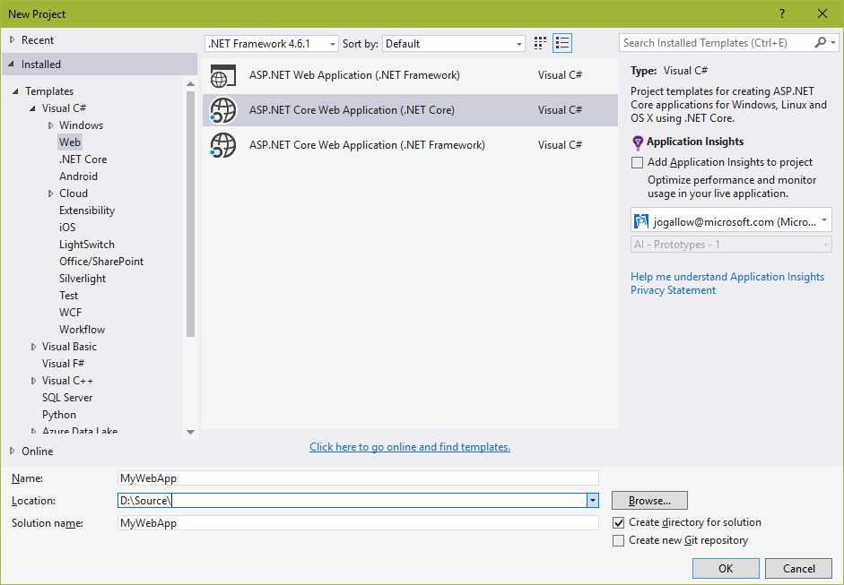
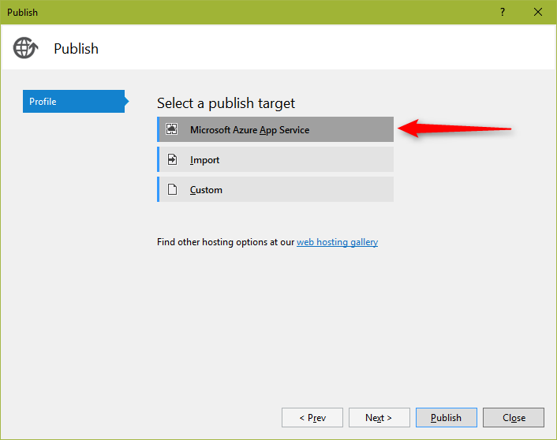
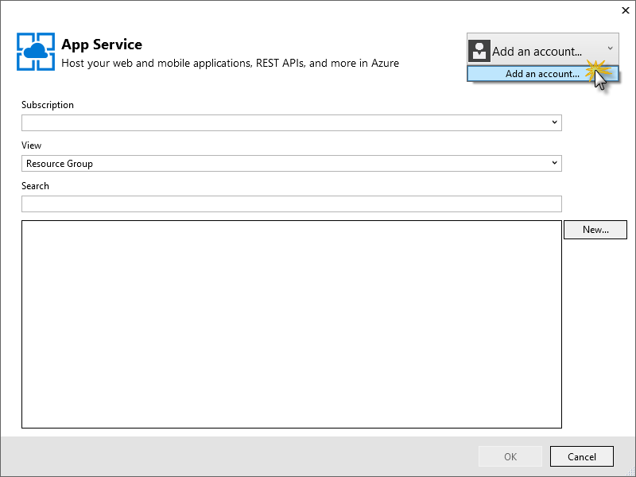
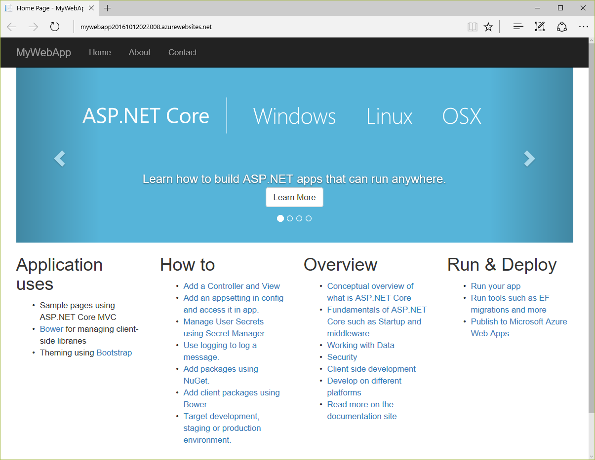

## Demo Prerequisites
- [Install Bash on Windows](https://msdn.microsoft.com/commandline/wsl/install_guide)
- [Install CLI 2.0 (Preview) under Bash](https://github.com/Azure/azure-cli/blob/master/doc/preview_install_guide.md#ubuntu-1404-lts-and-bash-on-windows-build-14362)
- [Git](http://www.git-scm.com/downloads).
- A Microsoft Azure account. If you don't have an account, you can 
[sign up for a free trial](/pricing/free-trial/?WT.mc_id=A261C142F) or 
[activate your Visual Studio subscriber benefits](/pricing/member-offers/msdn-benefits-details/?WT.mc_id=A261C142F).

## Creating a Web app in the Portal with GitHub Continuous Deployment
1. Create site in portal.
1. Connect to the [Node.js (Express) sample application repo](https://github.com/Azure-Samples/app-service-web-nodejs-get-started.git) on GitHub.
1. Show the initial deployment is triggered in the Azure portal.
1. Browse to the site to show the site is live.
1. Fork the repo in GitHub and clone your fork to your local machine.
1. Connect the site to the GitHub repo in your org.
1. Show site has been redeployed from GitHub project.
1. Change the title in `\views\index.jade` locally (or on GitHub) and push the change.
1. Switch to the portal and show that a redeployment has been triggered.
1. Refresh the site to show the change is live.

## Azure CLI 2.0 Preview
1. Open command prompt and enter bash mode by typing `bash`
1. Walk through the install steps to [Install CLI 2.0 (Preview) under Bash](https://github.com/Azure/azure-cli/blob/master/doc/preview_install_guide.md#ubuntu-1404-lts-and-bash-on-windows-build-14362). Note that everything was pre-installed as prerequisites, so the install steps should go quickly, even over slow wi-fi. Steps are as follows: 

    ```bash
      sudo apt-get update
      sudo apt-get install -y libssl-dev libffi-dev
      sudo apt-get install -y python-dev
      curl -L https://aka.ms/InstallAzureCli | sudo bash
    ```

1. Reload the bash environment to ensure tab completion works using `exec -l $SHELL`
1. List the available commands by typing `az`
1. Demonstrate browser-integrated login by typing `az login` and following the directions.
1. Change default output format to table by typing `az configure` and selecting the opion for table.
1. List resources by typing `az resource list`.

> Note: Additional CLI demo commands are demonstrated in the [Ignite presentation](https://myignite.microsoft.com/secondscreen/2673) at 34:00.

## Visual Studio Publishing
> Note: This is excerpted from the Managing Environments lab.

1. Open **Visual Studio Community 2015** and select **File | New | Project...** to create a new solution.

1. In the **New Project** dialog box, select **ASP.NET Core Web Application (.NET Core)** under the **Visual C# | Web** tab, and make sure **.NET Framework 4.6.1** is selected. Name the project _MyWebApp_, choose a **Location** and click **OK**.

    

    _New ASP.NET Web Application project_

1. In the **New ASP.NET Project** dialog box, select the **Web Application** template under **ASP.NET 5 Templates**. Also, make sure that the **Authentication** option is set to **No Authentication**. Make sure the "**Host in the cloud**" option is not checked (you will run this manually). Click **OK** to continue.

    

    _Creating a new project with the Web Application template_

1. Right-click the **MyWebApp** project and select **Publish...**. In the **Publish Web** dialog, click **Microsoft Azure App Service**.

    

    _Microsoft Azure App Service_

1. Click **Add an account...**. to sign in to Visual Studio with your Azure account.

    

    _Adding an account_

1. Then, click **New...** to open the _Create App Service_ dialog box. The _Create App Service_ dialog box will appear. Fill the **Web App Name** and **Resource Group** fields. Then click the **New...** button next to **App Service Plan**.

    

    _Create App Service dialog box_

1. Click **OK** in the Configure App Service Plan dialog.

    

    _Configure the App Service Plan_

1. Click the **Create** button in the Create App Service Plan and wait while Azure provisions your resources.

1. Back in the **Publish Web** dialog, all the connection fields should be populated. Click **Next >** to view the **Settings** tab, which shows the Configuration and Target Framework. Click **Publish** to publish the site.

    

    _Publishing the site to the new Microsoft Azure Web App_

    Once publishing completes, the web app will be automatically launched in your browser (at **http://{yourwebappname}.azurewebsites.net**).

    

    _Web app published to Azure_